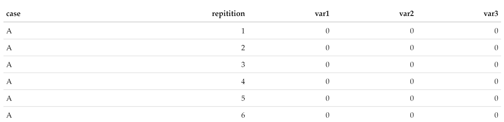

```{r setup, include=FALSE}
knitr::opts_chunk$set(echo = TRUE, results = 'hold', eval = FALSE)
```

## Introduction

R is a powerful programming language, and given its prevalance across the ORSA and Data Science communities, this discussion is geared towards those who want a deeper understanding of R and code optimization (read: faster!).  Though one may generally assume the basic structure used by R is the dataframe, this is not the case.  Rather, R utilizes, and is optimally written for, operations using atomic vectors (or lists).

While this subject is widely covered, the reference the SOCOM ORSA team commonly refers to is Hadley Wickham's book [Advanced R](https://adv-r.hadley.nz/index.html).  The use of lists in R may or may not be new to you, however writing code dealing with vectors and lists in R isn't necessarily _easy_.  Dataframes are widely known and utilized, especially when reading in .csv or .xlsx files.  Intuitively, the ability to view a dataframe in R Studio is a nice feature for a quick look at your data.  As previously stated however, they are not the native construct, and therefore (depending on your code), operations on a dataframe might not be as speedy as one would think.  This is often a point of frustration for some, as they regard R as a slow language, without consideration for its underpinnings.

The discussion in this post was generated by an initial code chunk, utilizing _for loops_ across a dataframe (read: quick answer), which was then optimized using lists in R.  The intent is not to disparage the use of dataframes or loops, rather, to show the realm of possible when attempting to write optimized (faster executing) code.

## Background

Though not discussed in this post, the simulation data used for this example was generated from a COVID-19 simulation model.  Cases A though D are user inputs, while baseline is the 'do nothing' scenario.  In this simulation, each case and the baseline were simulated 100 times, generating a dataframe output.  The dataframe and its variables were generically named, given they are not relevant to the current analysis, and replaced with var1-3, shown below.  For comparison of R, Python and function efficiency, the dataset was extended from 100 to 1000 replications for each case, as the team was concerned with variance between models, not the variance within each model run.


```{r}
load('sim_data.RData')
knitr::kable(head(sim_data))
```

```{r, eval=TRUE, echo=FALSE}

```

The baseline scenario was created to compare various experiment scenarios against, giving a user (read: command team) the ability to see the impact of their potential policy decisions.  As mentioned, for expediency sake, the dataframe output of the model was used to compare the baseline and scenarios A through D using two _for loops_ (read: cheap and dirty, but not efficient).  

Based on shifting timelines, and discussion within the team, the following examples were the result of optimizing the code base, getting away from purely dataframe operations.  Although one might scoff at _for loops_, they can be useful in R when utilized properly, and such is the case demonstrated below.

## Dataframes

A quick note on dataframes...they are great!  We truly love them, and they serve a purpose.  They however, like tibbles, have interesting behavior when it comes to operational speed and storage.  You can read about them in Advanced R [here](https://adv-r.hadley.nz/names-values.html#df-modify), but, in a nutshell, they are just a list of equal length vectors. Operations on a dataframe can be costly in terms of performance and memory, as mentioned in the previous reference, if not performed properly.  This is often the case, and as such, can lead to larger overhead storage and thus slower performing code.  Operations on vectors or lists (columns of a dataframe) are inherently quick, given they use what is native to R. Conversely, row wise operations become costly and inefficient in terms of memory allocation and speed.

## The Code

```{r}
library(magrittr)
library(purrr)
library(tidyr)
library(dplyr)
library(ggplot2)
library(data.table)
```

As previously mentioned, this code base was originally a portion of a larger COVID analytical app.  In building the app, a functional programming approach was used, and therefore, the optimized code section was a low-level function, called within the analytical guts of the shiny app.  As such, the attempts to optimize using various methods were also placed into function calls, so they could be benchmark tested against each other.

### Looping through a dataframe

The initial function took a dataframe as an input, and iteratively looped across each unique case and repetition.  Though operations on dataframe columns (vectors) can be executed quickly, such operations become inefficient when they are done row wise.

```{r}
  function_loop_through_dataframe <- function(input_data,
                                              seed=NULL){
    
    # Set the seed
    set.seed(seed)
    
    averages <- data.frame(matrix(nrow = 0, ncol = 5, dimnames = list(NULL, c("Case", "Rep", "var1", "var2", "var3"))))
    
    for (case in unique(input_data$case)){
      for (reps in unique(input_data$repitition)){
        
        input_data[input_data$case == case &
                                  input_data$repitition == reps,][3:5] -> curr_case
        
        input_data[input_data$case == 'baseline' &
                                  input_data$repitition == reps,][3:5] -> curr_base
        base_diff <- curr_case - curr_base
        new_row <- data.frame('Case' = as.factor(case), 
                              'repitition' = reps, 'diff_from_baseline' = base_diff)
        rbind(averages, new_row) -> averages
      } # close rep for loop
    } # close case for loop
    
    averages %>%  group_by(Case) %>% summarise_all(mean, na.rm=TRUE) %>% 
      mutate_at(c('diff_from_baseline.var1', 'diff_from_baseline.var2', 'diff_from_baseline.var3'),ceiling)-> averages
    
    # create output df
    return(averages)
    
  }
```

### List of lists mapping

Attempting to optimize the code using lists, the dataframe input was translated to a list of lists and the function purrr::map() and an anonymous function were used to iterate instead of loops.  The tidyr::nest() call distinctly subsets each group, defined by the dplyr::group_by() call, into separate dataframes, which are then further converted to lists of data within the list of cases, creating the list of lists.

```{r}
  function_list_mapping <- function(input_data, seed=NULL){
    set.seed(seed)
    #transform results from Df to names list of data
    #list has two elements, case (case names) and data (the data)
    input_data %>% 
      dplyr::group_by(case) %>% dplyr::summarise_at(c('var1', 'var2', 'var3'), mean, na.rm=TRUE) %>% 
      dplyr::group_by(case) %>% tidyr::nest() %>% purrr::map(~ ., as.list) -> DF_to_list_of_lists
    
    #name the individual elements of the data, to correspond with the case
    names(DF_to_list_of_lists$data)=DF_to_list_of_lists$case
    
    #use purrr:map to apply the anonymous function defined here to find the difference from baseline
    purrr::map(DF_to_list_of_lists$case, function(x) DF_to_list_of_lists$data[[x]] - DF_to_list_of_lists$data[['baseline']]) -> case_base_diffs
    
    #rename the new list to correspond with each case for output
    names(case_base_diffs)=DF_to_list_of_lists$case
    
    case_base_diffs %>% bind_rows() %>% cbind(.,DF_to_list_of_lists$case) %>% filter(DF_to_list_of_lists$case != 'baseline') -> baseline_diffs
    
    names(baseline_diffs)[names(baseline_diffs) ==  'DF_to_nested_list$case'] <- "case"
    
    return(baseline_diffs)
  }
```

### Nested list mapping

Similar to the list of lists above, this function converted the input dataframe into a  nested list (a list of cases, each with a dataframe of data).  In doing so, each case is distinctly called out in the list, while retaining the original dataframe format.  Operations are not conducted on the dataframe itself, rather against the list of dataframes created with the tidyr::nest() call mentioned above.  In doing so, efficiency is maintained using list operations.

```{r}
  function_nestedList_mapping <- function(input_data, seed=NULL){
    set.seed(seed)
    #group input data by case, summarise each variable with mean function and then turn into nested list
    input_data %>%
      group_by(case) %>% summarise_at(c('var1', 'var2', 'var3'), 
                                      mean, na.rm=TRUE) %>%
      group_by(case) %>% nest() -> DF_to_nested_list
    #set nested list names for data
    names(DF_to_nested_list$data)=DF_to_nested_list$case
    
    #purrr::map anonymous function to new nested list
    map(DF_to_nested_list$case, function(x) DF_to_nested_list$data[[x]] - DF_to_nested_list$data[['baseline']]) %>% bind_rows() %>% 
      cbind(.,DF_to_nested_list$case) %>% filter(DF_to_nested_list$case != 'baseline') -> baseline_diff
    
    #translate output to input names
    names(baseline_diff)[names(baseline_diff) ==  'DF_to_nested_list$case'] <- "case"
    
    return(baseline_diff)
    
  }
```


### Looping through lists

In additional to creating a list of lists and nested list for use with purrr::map(), the nested list was also tested using a traditional _for loop_ construct.  This function was created to show the difference between a _for loop_ using lists and one looping across a dataframe.  Although a _for loop_ is often a _naughty_ word in R speak, it is efficient when applied to lists not dataframe rows, for the reasons discussed above.

```{r}
  function_loop_through_lists <- function(input_data,
                                          seed=NULL){
    
    # Set the seed
    set.seed(seed)
    
    input_data %>% 
      group_by(case) %>% summarise_at(c('var1', 'var2', 'var3'), mean, na.rm=TRUE) %>%
      group_by(case) %>% tidyr::nest() -> DF_to_nested_list
    
    names(DF_to_nested_list$data)=DF_to_nested_list$case
    
    for (cases in unique(DF_to_nested_list$case)){ 
      
      DF_to_nested_list$data[[cases]] <- ceiling(DF_to_nested_list$data[[cases]] - DF_to_nested_list$data[['baseline']])
      
    }
    
    DF_to_nested_list$data %>% bind_rows() %>% 
      cbind(.,DF_to_nested_list$case) %>% filter(DF_to_nested_list$case != 'baseline') -> baseline_diff2
    
    names(baseline_diff2)[names(baseline_diff2) ==  'DF_to_nested_list$case'] <- "case"
    baseline_diff2 <- baseline_diff2[,c(4,3,2,1)]
    
    # create output df
    return(baseline_diff2)
    
  }
```


### Data Table operations

Because of the way the package [data.table](https://cran.r-project.org/web/packages/data.table/vignettes/datatable-intro.html) in R operates, it also takes advantage of lists.  Since operations in the second argument, j, are lists, it easily completes operations quickly and efficiently. We therefore see performance similar to the functions defined above, given operations are conducted on columns(lists).  Alternatively, row wise operations using the for loops above, would produce similarly slow returns, for similar reasons.

```{r}
function_data.table_manipulation <- function(input_data, seed=NULL){
    set.seed(seed)

    #transform dataframe to datatable
    sim_data_DT <- data.table(input_data)
    #select all data, calculate mean on specified columns, group by case
    sim_data_DT[,.(var1 = mean(var1), var2 = mean(var2), var3 = mean(var3)), by = .(case)] -> sim_data_DT
    # sim_data_DT[,lapply(.SD, mean), by = .(case), .SDcols = c('var1', 'var2', 'var3')]
    
    #set the key on case, so you can filter on case easily
    setkey(sim_data_DT, case)
    #apply function to difference all cases - baseline for iterator case list
    lapply(sim_data_DT[,case], function(x){sim_data_DT[x][,2:4] - sim_data_DT['baseline'][,2:4]}) -> baseline_diffs
    #transform list to DF for output sake
    do.call(rbind.data.frame, baseline_diffs) -> baseline_diffs
    #add case names back
    cbind(baseline_diffs, case = sim_data_DT[,case]) -> baseline_diffs
    #remove baseline
    baseline_diffs[case != 'baseline'] -> baseline_diffs
    
    return(baseline_diffs)
  } #close function_data.table_manipulation
```


## Takeaway

Just like the George Box quote referring to models, all code can also be wrong (in a sense) but useful as well.  As Hadley Wickham notes in [Advanced R]():

"It’s easy to get caught up in trying to remove all bottlenecks. Don’t! Your time is valuable and is better spent analysing your data, not eliminating possible inefficiencies in your code."
