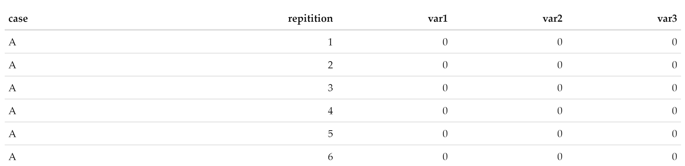

```{r setup, include=FALSE}
knitr::opts_chunk$set(echo = TRUE, results = 'hold', eval = FALSE, warning = FALSE, message = FALSE)
```

## Introduction

Python, similar to R, is common language used in the data science realm. It is for that reason, that we compare operations similar to those in R, written in Python.  A good reference book for this topic is the [Python Data Science Handbook](https://jakevdp.github.io/PythonDataScienceHandbook/).  Although it does not delve deep into some of the fundamentals that the Advanced R book does, it still does a good job covering the basics.

## Background

Though not discussed in this post, the simulation data used for this example was generated from a COVID-19 simulation model.  Cases A though D are user inputs, while baseline is the 'do nothing' scenario.  In this simulation, each case and the baseline were simulated 100 times, generating a dataframe output.  The dataframe and its variables were generically named, given they are not relevant to the current analysis, and replaced with var1-3, shown below.  For comparison of R, Python and function efficiency, the dataset was extended from 100 to 1000 replications for each case, as the team was concerned with variance between models, not the variance within each model run.

The baseline scenario was created to compare various experiment scenarios against, giving a user (read: command team) the ability to see the impact of their potential policy decisions.  As mentioned, for expediency sake, the dataframe output of the model was used to compare the baseline and scenarios A through D using two _for loops_ (read: cheap and dirty, but not efficient).  

Though the original code base was written in R, the team was curious as to the efficiency and ease of translating the functions from R to Python, hence this part of the blog post.

## Data structures in Python

For this discussion, we will cover lists and dictionaries in Python, as native constructs listed [here](https://www.w3schools.com/python/python_datatypes.asp), and additionaly look at the functionality of pandas dataframes.  These data types, both native (lists and dictionaries) and non-native (pandas dataframe) are extremely useful in the munging process during any data science project.  Similar to R, the Python language is optimized for operations using both lists and dictionaries, and like data.table in R, pandas dataframes are optimized as well.


## Reticulate
```{r}
library(reticulate)
```

Though you can argue for days about various IDE's for writing code, everyone has their favorite, and for this instance, we will continue to use R Studio and the reticulate package for Python code.  [Reticulate](https://rstudio.github.io/reticulate/index.html) is an R package that allows you to interpret Python code in various ways using R.  Using it in R studio also allows you to access [objects](https://rstudio.github.io/reticulate/index.html#python-repl) in the current R environment, as well as saving Python objects there as well.  

## The Code
```{python}
import pandas as pd
import pickle
import random
```

As in the previous example, we'll load and use the modified COVID sim data for comparison.  Since this is a Python example, the data was converted from .RData format to .p, a Python [pickle](https://docs.python.org/3/library/pickle.html), and read into memory as a pandas dataframe.

**Note:** Python [pickles](https://docs.python.org/3/library/pickle.html) are a binary object serialization of data, but are explicitly called out in Python documentation as being an insecure method for storing data, unless from a trusted source.

```{python}
python_sim_data = pickle.load( open( "py_sim_data.p", "rb" ) )
```
 Similar to R, we can look into the first rows of the dataframe using the .head() function, and see that we indeed are working with the same simulation data as the 'Lists in R' post.
```{python}
python_sim_data.head()
```

```{r, eval=TRUE, echo=FALSE}

```

### For loop through dataframe

As in the previous blog post, the Python code was written in a manner which inefficiently iterates across the dataframe using two _for loops_.  Each loop operation subtracts the current case from the base case and stores it in a new dataframe.  Once complete, the dataframe is aggregated, grouped and the difference from the baseline scenario is returned as a dataframe.
```{python}
def function_for_loop_dataframe(sim_data):
  #create empty dataframe
  average = pd.DataFrame(columns = ["Case", "Rep", 'var1','var2','var3'])
  for case in python_sim_data['case'].unique():
    for reps in python_sim_data['repitition'].unique():
      curr_case = python_sim_data[(python_sim_data['case']==case) & (python_sim_data['repitition']==reps)]
      curr_case = curr_case[['var1','var2','var3']]
      curr_base = python_sim_data[(python_sim_data['case']=='baseline') & (python_sim_data['repitition']==reps)]
      curr_base = curr_base[['var1','var2','var3']]
      base_diff = curr_case.subtract(curr_base.values)
      base_diff['Case'] = case
      base_diff['Rep'] = reps
      average = average.append(base_diff)
  aggregated_py_DF = average.groupby('Case')[['var1','var2','var3']].mean()
  baseline_diffs = aggregated_py_DF - aggregated_py_DF.loc['baseline'].values.squeeze()
  baseline_diffs = baseline_diffs.drop(labels='baseline')
  return(baseline_diffs)
```

### Pandas Dataframe operations

Similar to dplyr::group_by(), a pandas dataframe has a built in function call called [groupby](https://jakevdp.github.io/PythonDataScienceHandbook/03.08-aggregation-and-grouping.html), standard to any pandas dataframe object.  Similarly, we then extend the groups by utilizing the mean() function to summarize the respective variables columns called out in the square brackets.  In doing so, we have a similar, yet shorter (read: Pythonic, not tidyverse prose) line of code to aggregate our data. 

```{python}

def function_pandas_dataframe(sim_data):
  aggregated_py_DF = sim_data.groupby('case')[['var1','var2','var3']].mean()
  baseline_diffs = aggregated_py_DF - aggregated_py_DF.loc['baseline'].values.squeeze()
  baseline_diffs = baseline_diffs.drop(labels='baseline')

  return(baseline_diffs)

```


### Dictionary Operations - A way

To get an idea of the data construct created below, you can take a quick glimpse [here](https://jakevdp.github.io/PythonDataScienceHandbook/02.01-understanding-data-types.html), and see the power of a list in Python.  Similar to R, they are very dynamic and useful, as a list can contain any accepted data type in Python.  The function below, transforms the dataframe into a dictionary, where the key is the case name and the value is a list.  Within that list, are dictionaries, which represent each row in the dataframe, with variable names as the key and values as values.

**Note:** For dictionary operations (dictionary - dictionary), there seemed to be no _easy_ way to compute these operations, but there is some interesting code in this function because of that fact.  Additional steps were necessary to return the output in dataframe format like the functions above (necessary only for comparison).

```{python}
def function_dict_operations(sim_data):
  sim_data_list_of_dicts = sim_data.to_dict('records')
  #get baseline data
  baseline = [dict for dict in sim_data_list_of_dicts if 'baseline' in dict['case']]
  #get unique others names from list, except baseline
  unique = list(set(val for dict in sim_data_list_of_dicts for val in dict['case'] if dict['case'] != 'baseline'))
  #search across list of dicts, to create separated lists dynamically (from unique case names) - no hard coding
  sim_data_dict_of_case_dicts ={}
  for case in unique:
    sim_data_dict_of_case_dicts[case] = [dict for dict in sim_data_list_of_dicts if case in dict['case']]
  #create var list of interest
  var_list = ['var1','var2','var3']
  #add baseline name to unique list of cases 
  unique.append('baseline')
  #add baseline to sim_data_dict_of_case_dicts 
  sim_data_dict_of_case_dicts['baseline'] = baseline
  
  mean_dict = {}
  for case in unique:
    case_dict = {}
    for var in var_list:
      case_dict[var] = float(sum(d[var] for d in sim_data_dict_of_case_dicts[case])) / len(sim_data_dict_of_case_dicts[case])
    mean_dict[case] = case_dict
  
  case_diffs = {case: mean_dict[case].items() - mean_dict['baseline'].values() for case in mean_dict.keys()}
  case_diffs.pop('baseline')
  for case in case_diffs.keys():
    case_diffs[case] = {k:v for k,v in case_diffs[case]}
  case_diffs_df = pd.DataFrame.from_dict(case_diffs)
  return(case_diffs_df)
```

## Takeaway

Just like the George Box quote referring to models, all code can also be wrong (in a sense) but useful as well.  The book [Python Data Science Handbook](https://jakevdp.github.io/PythonDataScienceHandbook/01.07-timing-and-profiling.html) contains the following quote, which aptly describes code efficiency:

"In the process of developing code and creating data processing pipelines, there are often trade-offs you can make between various implementations. Early in developing your algorithm, it can be counterproductive to worry about such things. As Donald Knuth famously quipped, 'We should forget about small efficiencies, say about 97% of the time: premature optimization is the root of all evil.'"

