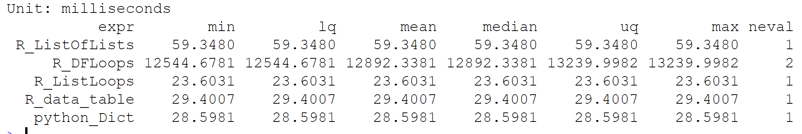
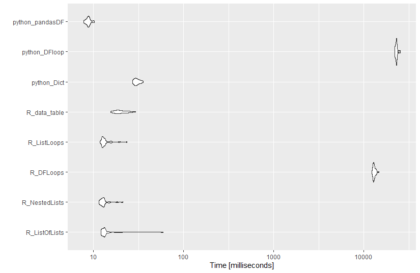

Introduction
------------

In previous posts, we presented various function implementations for a
small segment of analysis that was part of our COVID-19 modeling effort.
The original function in R, for loops, were a quick way to complete
computations, but given more time and effort, were thought to be
inefficient. As the team moved forward with *a way* that we know worked,
we decided to take a second look at some of the initial code base, in an
attempt to make it more efficient. As an ancillary discussion and
effort, the same code functionality was replicated various ways in
python. Once various implementations of the analysis were completed, the
overall set of functions was benchmarked for comparison, resulting in
this post.

Background
----------

Though not discussed in this post, the simulation data used for this
example was generated from a COVID-19 simulation model. Cases A though D
are user inputs, while baseline is the ‘do nothing’ scenario. In this
simulation, each case and the baseline were simulated 100 times,
generating a dataframe output. The dataframe and its variables were
generically named, given they are not relevant to the current analysis,
and replaced with var1-3, shown below. For comparison of R, Python and
function efficiency, the dataset was extended from 100 to 1000
replications for each case, as the team was concerned with variance
between models, not the variance within each model run.

    load('sim_data.RData')
    knitr::kable(head(sim_data))

The baseline scenario was created to compare various experiment
scenarios against, giving a user (read: command team) the ability to see
the impact of their potential policy decisions. As mentioned, for
expediency sake, the dataframe output of the model was used to compare
the baseline and scenarios A through D using two *for loops* (read:
cheap and dirty, but not efficient).

Benchmark testing
-----------------

With each function defined, the microbenchmark package for R was
utilized to conduct benchmark testing. Again, as mentioned above, the
book [Advanced R](http://adv-r.had.co.nz/Performance.html) contains a
great section discussing code performance and benchmarking. The
benchmark test conducted here is similar to the reference material in
the book, and only utilized to show code performance comparisons.

    source('dscoe_r_functions.R')
    library(magrittr)
    library(purrr)
    library(tidyr)
    library(dplyr)
    library(ggplot2)
    library(data.table)
    library(reticulate)

Importing the functions from the python script is easily accomplished
using the import call from reticulate. This call bypasses the need to
explicitly call a python chuck in markdown to import python functions.

    python_functions = reticulate::import('dscoe_python_functions')

    mbm <- microbenchmark::microbenchmark(
      
    "R_ListOfLists" = {function_list_mapping(sim_data)},

    "R_NestedLists" = {function_nestedList_mapping(sim_data)},

    "R_DFLoops" = {function_loop_through_dataframe(sim_data)},

    "R_ListLoops" = {function_loop_through_lists(sim_data)},

    "R_data_table" = {function_data.table_manipulation(sim_data)},

    "python_Dict" = {python_functions$function_dict_operations(sim_data)},

    "python_DFloop" = {python_functions$function_for_loop_dataframe(sim_data)},

    "python_pandasDF" = {python_functions$function_pandas_dataframe(sim_data)},

    times = 30
    )

Upon completion of the microbenchmark test, we can inspect the resulting
data and see there is a list corresponding to the length of time it took
to complete each test, for each test iteration.

    knitr::kable(head(mbm))

Plotting the benchmark test results, we can see that using native
constructs in each language gives similar performance. Alternatively,
the inefficiency of loops across dataframes in each language clearly
shows the drawbacks of this method.

    autoplot(mbm)

Optimized code translates to faster running code and more efficient
memory usage, and here you clearly see looping through a dataframe
(inefficiently) increases execution time for both R and Python. Though
it seems to be a small amount of time, as those changes in execution
time are aggregated, they can result in *large* changes to scripts or
shiny apps. Similarly, we see that functions written optimally in each
language are relatively similar, with execution times being generally
similar around 10 milliseconds.

### Python native benchmark testing

There are a few methods for benchmark testing in python, however we used
the simplest of methods, the time package. Interestingly enough, it is
important to pay attention to the functions that are used in any
language, and we found that the time.process\_time() call did not
provide enough precision to fully time the quicker functions. Since
multiple iterations resulted in zero time for computation, the
time.perf\_counter() call was used, resulting in precision out to 16
decimal places.

Takeaway
--------

So, which is better? R? Python? As you can see, there are clearly
differences in the plots above, but those differences are overshadowed
by the difference between efficient and inefficient code. Both R and
Python similarly handled our data munging and small analytical tasks,
giving us no *clear* winner to the debate. Rather, careful thought
should be placed on the reason that one language versus the other is
chosen. Both R (shiny) and Python (flask) have the ability to generate
analytical web apps, and are aptly suited to handle the majority of data
science tasks. Subtle differences however, in the languages and their
associated packages can make the difference and it is therefore
important to choose the correct tool for the task.

In the end, the difference between analytical code and production code
is important, but does not always overcome the need to nicely view a
dataframe logically in your IDE. For smaller analytical tasks, code
performance is eclipsed by necessity. Use what you know, how you know
how to use it!

<!--chapter:end:benchmark_testing.Rmd-->
